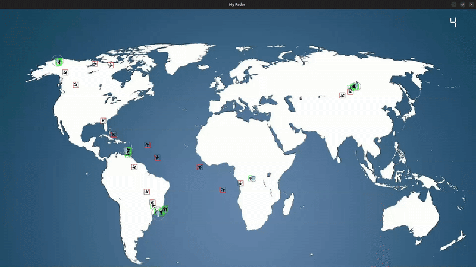

# ✈️ my_radar - Air Traffic Simulator 🛫

 

## 🎯 About the Project
Welcome to **my_radar**, a **2D air traffic simulator** built using **CSFML**. The goal is to **simulate the movement of airplanes** and ensure they navigate safely under the supervision of control towers.

## 📸 Screenshots


## 🚀 Features
   • Realistic simulation of airplane trajectories.  
   • Collision detection between aircraft.  
   • Control towers preventing collisions between airplanes.   
   • Smooth animations and performance-optimized.

## 🛠️ Installation & Compilation

### 1️⃣ Install Required Dependencies
```bash
sudo apt-get update
sudo apt-get install build-essential libcsfml-dev
```

### 2️⃣ Clone & Compile
```bash
git clone https://github.com/Snogyy/my_radar.git
cd my_radar
make
./my_radar generator/randomly_generated_file
```

## 🔗 Links
[CSFML Documentation](https://www.sfml-dev.org/documentation/2.5.1/)  

---

Epitech students, beware of -42 !
